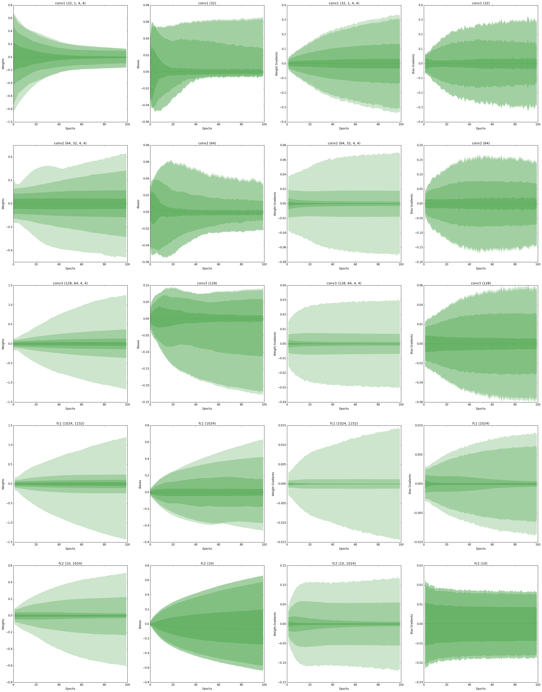

# Neural Network Monitoring for Chainer Models

This is a Chainer plugin for computing statistics over weights, biases and gradients during training.

You can collect the above mentioned data from any [chainer.Chain](http://docs.chainer.org/en/stable/reference/core/link.html) and repeat it for each iteration or epoch, saving them to a log using e.g. [chainer.report()](http://docs.chainer.org/en/stable/reference/util/reporter.html) to plot the statistical changes over the course of training later on.

*Note: It is not yet optimized for speed. Computing percentiles is for instance slow.*

## Statistics



*An example plot of weights, biases and gradients from different convolutional and fully connected layers.*

### Data

- Mean
- Standard deviation
- Min
- Max
- Percentiles
- Sparsity (actually just counting number of zeros)

### Targets

- Weights
- Biases
- Gradients

For a **specific layer** or the aggregated data over the **entire model**.

### Dependencies

Chainer 1.18.0 (including NumPy 1.11.2)

## Example

### Usage

```python
# This is simplified code, see the 'example' directory for a working example.
import monitor

# Prepare the model.
model = MLP()
optimizer.setup(model)

# Forward computation, back propagation and a parameter update.
# The gradients are still stored inside each parameter after those steps.
loss = model(x, t)
loss.backward()
optimizer.update()

# Use the plugin to collect data and nicely ask Chainer to include it in the log.
weight_report = monitor.weight_statistics(model)
chainer.report(weight_report) # Mean, std, min, max, percentiles

bias_report = monitor.bias_statistics(model)
chainer.report(bias_report)

fst_layer_grads = monitor.weight_gradient_statistics(model, layer_name='fc1')
chainer.report(fst_layer_grads)

zeros = monitor.sparsity(model, include_bias=False)
chainer.report(zeros)
```

### Plotting the Statistics

Weights and biases when training a small convolutional neural network for classification for 100 epochs aggregated over all layers (including final fully connected linear layers). The different alphas show different percentiles.

#### Weights


#### Biases


